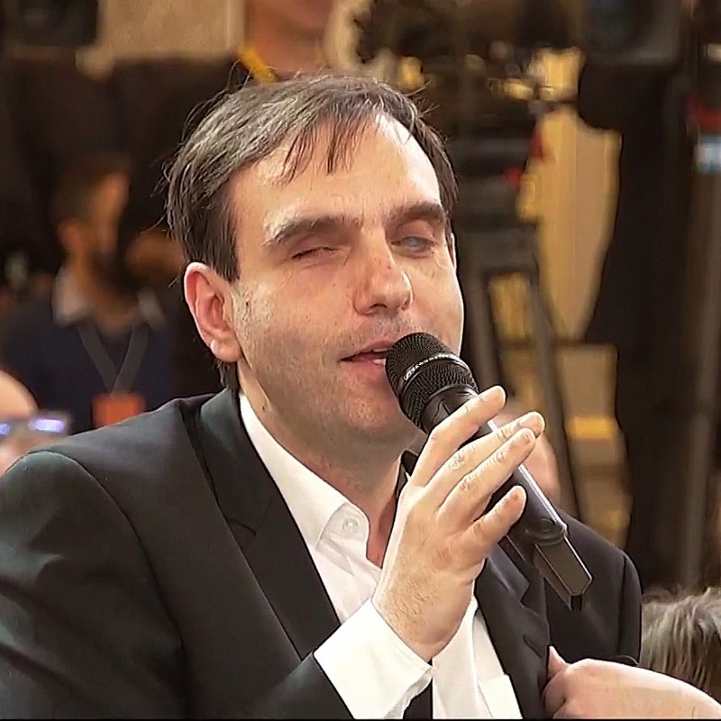
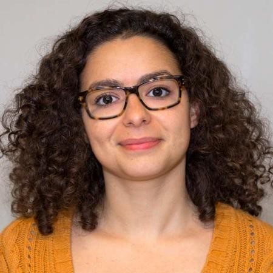

En septembre 2020, nous avons lancé le [Commando UX](/commando-ux){title="Commando UX"} : 15 designers, développeuses et développeurs recrutés au sein de notre équipe et déployés pendant 7 mois dans les administrations. Leur objectif : améliorer l'expérience utilisateur et l'accessibilité numérique de 10 des [250 démarches administratives les plus utilisées](https://observatoire.numerique.gouv.fr){title="Observatoire de la qualité des démarches en ligne - nouvelle fenêtre"} par les Français.

À l’occasion de la clôture de la saison 1 du Commando UX, l’équipe Design des services numériques de la direction interministérielle du numérique (DINUM) organise un événement sur trois soirées et trois thématiques : la recherche utilisateur, l'inclusion et l'accessibilité, et l'art de gouverner.

_*_ Le titre de cet événement s'inspire d'un terme de design : le « design centré utilisateur », soit prendre en compte les besoins des utilisateurs à chaque étape du processus de développement d'un produit ou service. Ce titre, c'est un défi lancé à nos administrations car dans le domaine du numérique, l'État a encore beaucoup de chemin à parcourir pour produire des services compréhensibles, utilisables et souhaitables.

## 3 soirées à revivre

**Vous pouvez revivre ces moments sur [notre chaîne Youtube](https://www.youtube.com/playlist?list=PLzwHdQWfGYgaaSrJNhXYLegMdQlX3AQmo){title="notre chaine YouTube - nouvelle fenêtre"}**

Le témoignage d’un Commando UX 2020 suivi d’une table ronde virtuelle sur une nouvelle thématique chaque soir.

## Mardi 6 avril : « Répondre à des besoins concrets »

Lors de cette première soirée, nous découvrirons l'importance d'aller à la rencontre des usagers, de les écouter, de les comprendre. Nous aborderons les principes et méthodes de la recherche usager, indispensable à tout projet pour s'assurer de la pertinence d'un service, pour simplifier ce service et ses fonctionnalités à l'essentiel, et pour mieux fédérer vos équipes et donner du sens à leur mission (en bonus, cela vous permettra aussi de réduire les coûts d'un projet).

**[Revoir l’événement « Répondre à des besoins concrets »](https://www.youtube.com/watch?v=6hsc_hCOhVo&list=PLzwHdQWfGYgaaSrJNhXYLegMdQlX3AQmo&index=3){title="Revoir l’événement Répondre à des besoins concrets - nouvelle fenêtre"}**

### 18h00
Ouverture de l'événement par [Amélie de Montchalin](https://twitter.com/ademontchalin){title="Amélie de Montchalin sur Twitter - nouvelle fenêtre"}, Ministre de la Transformation et de la Fonction publiques et [Nadi Bou Hanna](https://fr.linkedin.com/in/nadi-bou-hanna){title="Nadi Bou Hanna  sur linkedin - nouvelle fenêtre"}, directeur interministériel du numérique.

### 18h10
Retour sur le Commando [Contestation de contravention](/commando-ux/defi-contestation-contravention) avec [Lola Charpentier](/equipe/lola-charpentier/), [Manon Oresve](/equipe/manon-oresve/) et [Lucile Foraison](/equipe/lucile-foraison/).

### 18h30
Table ronde animée par [Ugo Dessertine](/equipe/ugo-dessertine), lead designer au sein du pôle design des services numériques.

Autour de cette table virtuelle :

**[Kheira Belkacem](https://www.linkedin.com/in/kbelkacem){title="Kheira Belkacem sur linkedin - nouvelle fenêtre"}** 
Experte en recherche utilisateur anciennement à la direction interministérielle du numérique (DINUM)

**[Louis Beziau](https://www.linkedin.com/in/louisbeziau/){title="Louis Beziau sur linkedin - nouvelle fenêtre"}** 
Designer et co-directeur du studio de design Les Sismo

**[Alexandre Gardette](https://www.linkedin.com/in/alexandre-gardette-a1309235/){title="Alexandre Gardette sur linkedin - nouvelle fenêtre"}** 
Chef de la Mission France Recouvrement

**[Camille Rozier](https://fr.linkedin.com/in/camille-rozier-phd-489aa033){title="Camille Rozier sur linkedin - nouvelle fenêtre"}** 
Docteure en sciences comportementales à la direction interministérielle de la transformation publique (DITP)

## Mercredi 7 avril : « Des services pour toutes et tous, accessibles & inclusifs »

Nous sommes toutes et tous différents derrière nos écrans. Que nous soyons en situation de handicap, très à l'aise avec le numérique, que nous le détestions, que nous ayons accès à un ordinateur, ou pas, que nous ne comprenions rien au langage administratif (coucou tout le monde 👋), il y a une chose qui nous réunit : c'est que nous devons tous avoir un accès égal à nos services publics. Une même facilité d'intéraction avec ces services.

**[Revoir l’événement « Des services pour toutes et tous, accessibles & inclusifs »](https://www.youtube.com/watch?v=uL476FeyUH4&list=PLzwHdQWfGYgaaSrJNhXYLegMdQlX3AQmo&index=4){title="Revoir l’événement Des services pour toutes et tous, accessibles & inclusifs - nouvelle fenêtre"}**

### 18h00
Introduction de la soirée par [Marine Boudeau](/equipe/marine-boudeau), cheffe du pôle design des services numériques.

### 18h10
Retour sur le Commando [Place de l'emploi public](/commando-ux/defi-postuler-emploi-public) avec [Julie Leroy](/equipe/julie-leroy/) et [Édouard Sastre](/equipe/edouard-sastre/).

### 18h30
Table ronde animée par [Anthony Brunelli](/equipe/anthony-brunelli), chargé de mission au sein du pôle design des services numériques.

Autour de cette table virtuelle :

**[Gwenaëlle Brochoire](https://www.linkedin.com/in/gwenaellebrochoire/){title="Gwenaëlle Brochoire sur linkedin - nouvelle fenêtre"}** 
Designer de service inclusive et co-fondatrice de Oocity

**[Géraldine Da Sylva](https://www.linkedin.com/in/gdasylva/){title="Géraldine Da Sylva sur linkedin - nouvelle fenêtre"}** 
Cheffe de produit Service-Public.fr à la direction de l'information légale et administrative (DILA)

**[Fernando Pinto da Silva](https://www.linkedin.com/in/fpintodasilva){title="Fernando Pinto da Silva sur linkedin - nouvelle fenêtre"}** 
Chargé de mission stratégie numérique, Fédération des Aveugles et Amblyopes de France

## Jeudi 8 avril : « L’art de gouverner : un moyen essentiel pour maîtriser la qualité et la durabilité des services »

Nous devons produire des services maintenables, désirables, compréhensibles, sémantiques, accessibles, réactifs, respectueux de la vie privée. En somme des services qui donnent confiance et qui font confiance. Et pour y parvenir, ces mêmes valeurs doivent exister dans les méthodes de management au sein des administrations.

**[Revoir l’événement « L’art de gouverner »](https://www.youtube.com/watch?v=Sm26uzOqFys&list=PLzwHdQWfGYgaaSrJNhXYLegMdQlX3AQmo&index=5){title="Revoir l’art de gouverner - nouvelle fenêtre"}**

### 18h00
Introduction de la soirée par [Marine Boudeau](/equipe/marine-boudeau), cheffe du pôle design des services numériques.

### 18h10
Retour sur le Commando [Titre de séjour](/commando-ux/defi-titre-de-sejour) avec [Pierre-Brice Haurie](/equipe/pierre-brice-haurie/) et [Améziane Allioui](/equipe/ameziane-allioui/).

### 18h30
Table ronde animée par [Marine Boudeau](/equipe/marine-boudeau), cheffe du pôle design des services numériques.

Autour de cette table virtuelle :

**[Geoffrey Arthaud](https://www.linkedin.com/in/geoffreyarthaud/){title="Geoffrey Arthaud sur linkedin - nouvelle fenêtre"}** 
Responsable des pratiques Agiles au Service du Numérique du Ministère de la Transition Écologique

**[Hela Ghariani](https://www.linkedin.com/in/hela-ghariani-10208566/){title="Hela Ghariani sur linkedin - nouvelle fenêtre"}** 
Directrice de projets à la délégation du numérique en santé

**[Apolline Le Gall](https://www.linkedin.com/in/apolline-le-gall/){title="Apolline Le Gall sur linkedin - nouvelle fenêtre"}** 
Chercheuse, co-Fondatrice de l'agence Où sont les Dragons

**[Stéphane Vincent](https://www.linkedin.com/in/svincent/){title="Stéphane Vincent sur linkedin - nouvelle fenêtre"}** 
Cofondateur de la 27e Région

