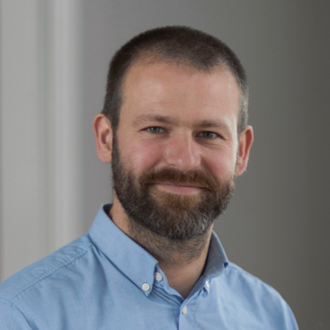
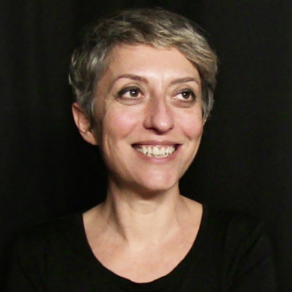

À l’occasion de la clôture de la saison 2020 du [Commando UX](/commando-ux), l’équipe Design des services numériques de la direction interministérielle du numérique (DINUM) organise un événement pour rendre compte des travaux menés par cette première promotion, et animer 3 regards croisés autour des enjeux du design numérique au sein de l'État.

## 3 soirées à ne pas manquer.
**Les 6, 7 et 8 avril, venez échanger avec nous à partir de 18h.**
Cet événement est ouvert à tous et sera diffusé en direct sur [notre chaine YouTube](https://www.youtube.com/channel/UCMH9lC8dSlRVRfb0LoKuJZw) en 100% accessible (langue des signes française et transcription).

[Inscriptions](https://framaforms.org/letat-centre-usager-oui-cest-possible-1613408477){: .button .item__link button .button--highlight }

Vous recevrez un e-mail de rappel avant l'événement.  

## Mardi 6 avril : « Répondre à des besoins concrets : le design centré usagers »

### 18h00
Introduction par [Nadi Bou Hanna](https://fr.linkedin.com/in/nadi-bou-hanna), directeur interministériel du numérique.

### 18h15
Retour sur le Commando qui a travaillé sur la démarche [Contestation de contravention](/commando-ux/defi-contestation-contravention), suivi par un échange avec le public.
Avec [Lola Charpentier](/equipe/lola-charpentier/), [Manon Oresve](/equipe/manon-oresve/) et [Lucile Foraison](/equipe/lucile-foraison/).

### 18h30
Table ronde animée par [Ugo Dessertine](/equipe/ugo-dessertine), lead designer au sein du pôle design des services numériques.

Autour de cette table virtuelle :

**[Kheira Belkacem](https://www.linkedin.com/in/kbelkacem)** 
Experte en recherche utilisateur à la direction interministérielle du numérique (DINUM)

**[Louis Beziau](https://www.linkedin.com/in/louisbeziau/)** 
Designer chez Les Sismo

**[Alexandre Gardette](https://www.linkedin.com/in/alexandre-gardette-a1309235/)** 
Chef de la Mission France Recouvrement

**[Camille Rozier](https://fr.linkedin.com/in/camille-rozier-phd-489aa033)** 
Docteure en sciences comportementales à la direction interministérielle de la transformation publique (DITP)

## Mercredi 7 avril : « Des services pour tous accessibles & inclusifs »

### 18h00
À venir

### 18h15
Retour sur le Commando qui a travaillé sur la démarche [Place de l'emploi public](/commando-ux/defi-postuler-emploi-public), suivi par un échange avec le public.
Avec [Julie Leroy](/equipe/julie-leroy/) et [Édouard Sastre](/equipe/edouard-sastre/).

### 18h30
Table ronde animée par [Anthony Brunelli](/equipe/anthony-brunelli), chargé de mission au sein du pôle design des services numériques.

Autour de cette table virtuelle :

**[Gwenaëlle Brochoire](https://www.linkedin.com/in/gwenaellebrochoire/)** 
Inclusive service designer et co-fondatrice de Oocity

**[Géraldine Da Silva](https://www.linkedin.com/in/gdasylva/)** 
Cheffe de produit Service-Public.fr à la direction de l'information légale et administrative (DILA)

**[Fernando Pinto da Silva](https://www.linkedin.com/in/fpintodasilva)** 
Chargé de mission stratégie numérique, Fédération des Aveugles et Amblyopes de France

**[Mehdi Serdidi](https://www.linkedin.com/in/mehdi-serdidi-553b16a5/)** 
Directeur de l'association ASTS

## Jeudi 8 avril : « Des services pour tous accessibles & inclusifs »

### 18h00
À venir

### 18h15
Retour sur le Commando qui a travaillé sur la démarche [Titre de séjour](/commando-ux/defi-titre-de-sejour), suivi par un échange avec le public.
Avec [Pierre-Brice Haurie](/equipe/pierre-brice-haurie/) et [Améziane Allioui](/equipe/ameziane-allioui/).

### 18h30
Table ronde animée par [Marine Boudeau](/equipe/marine-boudeau), cheffe du pôle design des services numériques.

Autour de cette table virtuelle :

**[Geoffrey Arthaud](https://www.linkedin.com/in/geoffreyarthaud/)** 
Responsable des pratiques Agiles au Service du Numérique du Ministère de la Transition Écologique

**[Hela Ghariani](https://www.linkedin.com/in/hela-ghariani-10208566/)** 
Directrice de projets à la délégation du numérique en santé

**[Apolline Le Gall](https://www.linkedin.com/in/gwenaellebrochoire/)** 
Chercheuse, co-Fondatrice de l'agence Où sont les Dragons

**[Stephane Vincent](https://www.linkedin.com/in/svincent/)** 
Cofondateur de la 27e Région

