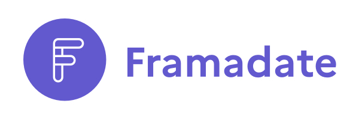
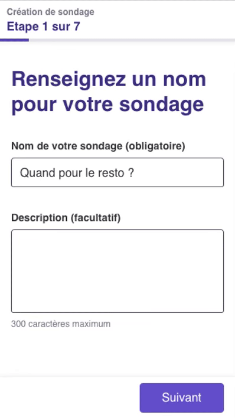

## Contribuer concrètement au logiciel libre par le design et l'accessibilité

En plus de son activité habituelle, **le pôle Design des services numériques (DSN) a lancé une initiative dédiée au logiciel libre**.

Le pôle DSN souhaite ainsi poursuivre la mission déjà engagée lors de projets plus anciens, tel que le [Socle interministériel du logiciel libre](https://sill.etalab.gouv.fr), en complétant les actions de la DINUM par une contribution concrète à un outil régulièrement utilisé dans les administrations. Ainsi, l'équipe apporte une expertise dans le domaine du **design et de l'accessibilité**, deux versants pour lesquels les acteurs du logiciel libre disposent souvent de peu de ressources. Cette initiative ne pourrait pas être possible sans le soutien financier du [FIPHFP](http://www.fiphfp.fr/).

Le premier logiciel libre à bénéficier de cette initiative est l'outil [Framadate](https://framadate.org) de [Framasoft](https://framasoft.org/) ! Après des échanges avec les membres de l'association et un audit de l'outil, nous avons pu définir deux grands axes d'amélioration : le parcours utilisateur sur mobile et l'optimisation de l'accessibilité.

### Nouvelle identité

A cette occasion, nous avons travaillé sur une nouvelle identité graphique, ainsi qu'un nouveau logo :

### Interface mobile simplifiée et accessible
Le prototype est aujourd'hui en cours de réalisation, et fera l'objet de tests utilisateurs dès novembre 2021.

**Nous aurons le plaisir de présenter le projet lors de la journée Blue Hats** au salon Open Source Expérience le 9 novembre 2021.

## Nous rejoindre au salon Open Source Expérience 2021

Pour nous rejoindre, inscrivez-vous gratuitement au salon [Open Source Experience](https://www.opensource-experience.com/ ) et retrouvez-nous le **9 novembre à 15h** en salle 223M… ou en suivant les chapeaux bleus du collectif Blue Hats ! 🧢

Adresse :  
**Palais des Congrès**  
2 Place de la Porte Maillot  
75017 Paris

**[Consulter le programme de la journée Blue Hats](https://github.com/blue-hats/journee-bluehats-osx-2021)**
